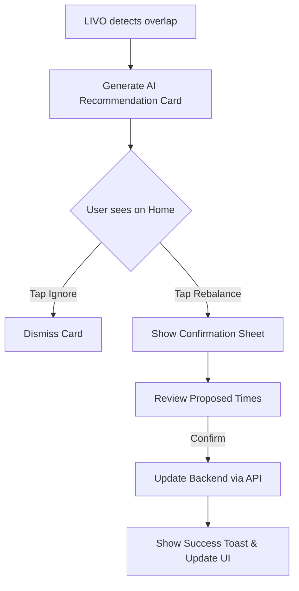

# LIVO: Personal Life Operating System
## Design System & UX Architecture

This document serves as the single source of truth for LIVO's UI/UX design, component architecture, AI integration, and design philosophy. It is designed to guide frontend development using React Native and Expo.

---

## 1. PRODUCT DESIGN PRINCIPLE

LIVO is a **Personal Life Operating System**, not merely a task-management application. It is an intelligent, interconnected environment covering:
- Home
- Tasks
- Schedule / Calendar
- Goals
- Habits
- Learning
- Finance
- Travel
- Insights
- AI Chat / AI Assistant
- Add / Capture
- Profile / Settings

**Core Philosophy:** The primary UX question LIVO answers is: *"What matters to me right now?"* 
The modules must feel interconnected. The AI (LIVO AI) must act as a native intelligence layer that assists rather than commands.
**Interaction Rule:** Understand → Recommend → Explain → Confirm → Execute.
**Resilience:** LIVO must remain fully functional and useful even when AI is unavailable.

---

## 2. DESIGN LANGUAGE

### Design Philosophy
Modern, Calm, Intelligent, Personal, Premium, Minimal, Human, Highly readable. No templated AI features. No unnecessary decorative elements. No excessive glassmorphism.

### Color System (Dark Mode First)
- **Primary:** `#6366F1` (Indigo)
- **Primary Dark:** `#4F46E5`
- **AI Accent:** `#8B5CF6` (Purple - exclusively for AI features)
- **Background:** `#0F172A` (Deep Slate)
- **Surface:** `#1E293B` (Slate)
- **Elevated Surface:** `#334155` (Border/Divider)
- **Text Primary:** `#F8FAFC`
- **Text Muted/Secondary:** `#94A3B8`
- **Success:** `#10B981` (Emerald)
- **Warning:** `#F59E0B` (Amber)
- **Error/Danger:** `#EF4444` (Red)

### Typography
- **Font Family:** System default sans-serif (Inter/SF Pro/Roboto) optimized for legibility.
- **Display Typography:** Clean, unadorned. Avoid single-word color accents.
- **Scale:**
  - H1: 28px / 34px line-height, Bold
  - H2: 22px / 28px line-height, SemiBold
  - H3: 18px / 24px line-height, Medium
  - Body: 16px / 24px line-height, Regular
  - Small text: 14px / 20px line-height, Regular
  - Caption: 12px / 16px line-height, Medium
  - Button text: 16px / 24px line-height, SemiBold
  - Numeric/Data: Tabular numerals, 14px, Medium

### Spacing Scale
4px, 8px, 12px, 16px, 20px, 24px, 32px, 40px, 48px, 64px.

### Shapes & Elevation
- **Border Radius:**
  - Card: 16px
  - Button/Input: 10px
  - Badges: 6px
- **Shadows:** Minimal soft shadows, primarily relying on border (`#334155`, 1px) for separation in dark mode.
- **Touch Targets:** Minimum 48x48px for all interactive elements.

---

## 3. MOBILE-FIRST DESIGN

Designed for React Native / Expo (iOS & Android).
- **Navigation:**
  - Bottom Tab Navigation for core areas (Home, Planning, LIVO AI, Insights). Max 4-5 tabs.
  - Top Navigation for contextual actions (Back, Settings, Filters).
- **Floating Actions:** Persistent FAB for quick "Add / Capture" only on relevant screens.
- **Modals & Sheets:** Use Bottom Sheets for contextual inputs, detailed views, and AI confirmations to retain spatial context. Full-screen flows only for complex onboarding or deep data entry.
- **Gestures:** Pull-to-refresh on scrollable lists, swipe-to-delete/complete on tasks.

---

## 4. HOME SCREEN

The "What matters now?" screen. Adapts dynamically based on time and user context.

**Sections:**
1. **Greeting & Context:** e.g., "Good Morning, Alex" + Date + LIVO OS Badge.
2. **Dynamic AI Context Card:** (See Section 7) Only appears when a highly relevant recommendation exists.
3. **Today's Focus / Priority Task:** The single most important item.
4. **Schedule / Next Event:** What's happening next.
5. **Active Goals / Habits:** Horizontal scroll of current progress.

---

## 5. TASK DESIGN

**Task Card Anatomy:**
- **Indicators:** Circular completion checkbox, priority color indicator.
- **Data:** Title, concise meta (Duration, Due Time, Status).
- **Context:** Goal/Habit connection (e.g., "Supports: Portfolio").
**States:** Normal, Completed (strikethrough, muted), Overdue (danger text), AI Suggested (AI border).
**Creation:** Supports natural language parsing (e.g., "Finish my portfolio tomorrow at 7 PM" parses directly to structured Date/Time fields).

---

## 6. AI UX

LIVO AI is a native intelligence layer, not just a chatbot.
- **Reactive AI:** User asks a question in the AI Chat; LIVO responds with structured components.
- **Proactive AI:** LIVO detects a pattern (e.g., schedule conflict) and presents a recommendation card in the relevant context (Home or Schedule).

---

## 7. AI RECOMMENDATION CARD

Reusable component for proactive AI suggestions.
**Anatomy:**
- **Header:** "⚡ LIVO SUGGESTS" (AI Accent color).
- **Recommendation:** Clear, active voice (e.g., "Work on your portfolio at 4 PM").
- **Why:** Contextual reasoning (e.g., "You have 90 minutes free and this task supports your career goal").
- **Actions:** Primary [Execute/Add], Secondary [Not Now/Ignore].

*Crucial Rule:* Never frame suggestions as commands. Always explain the "Why".

---

## 8. AI CHAT SCREEN

A dedicated space for complex assistance.
- **Header:** LIVO AI identity, status.
- **Content:** Interleaved conversation history.
- **AI Responses:** Not just text. Uses Structured Components (Task Cards, Schedule Proposals).
- **Input:** Text input, Voice input (waveform), Suggested prompt chips.

---

## 9. STRUCTURED AI RESPONSE COMPONENTS

AI output renders native UI components based on JSON payloads.
- **Types:** Recommendation, Task Card, Goal Card, Schedule Proposal, Conflict Warning, Progress Summary, Insight Chart, Confirmation Action.

---

## 10. AI ACTION PERMISSION UX

1. **Level 1 — Inform:** No confirmation. (e.g., "You have 3 tasks left").
2. **Level 2 — Suggest:** User chooses to proceed. (e.g., Recommendation Cards).
3. **Level 3 — Prepare:** AI drafts a change (e.g., populates a New Task sheet), user hits Save.
4. **Level 4 — Execute:** Explicit confirmation required. (e.g., Moving an event, modifying finances).

*Rule:* LIVO AI NEVER silently deletes data, modifies finances, or sends external messages.

---

## 11. AI EXPLAINABILITY

Must answer:
- **WHAT:** The proposed action.
- **WHY:** The reasoning based on user data.
- **IMPACT:** The result of accepting the action.

---

## 12. AI CONFIDENCE

- **High Confidence:** Standard UI integration.
- **Moderate Confidence:** Label as "Suggested" or "Based on your schedule".
- **Low Confidence:** Explicitly ask for user clarification.

---

## 13. AI SILENCE / NOTIFICATION UX

- **Rule of Silence:** Only meaningful recommendations reach the user. No generic "You have tasks today!" notifications.
- **Trigger:** Contextual value (e.g., "Client proposal due today + 90 min free block detected").

---

## 14. SCHEDULE / CALENDAR

- **Views:** Day list, Week timeline.
- **Entities:** Events, Tasks (time-blocked), Habits, Free time blocks.
- **AI Integration:** Visually highlights conflicts (red hash pattern) and unscheduled important tasks. Offers 1-tap "Rebalance" proposals.

---

## 15. GOALS

- **UI:** Progress Rings, Milestones lists, Linked Tasks/Habits.
- **AI Actions:** "Break into milestones", "Suggest recovery plan" (if falling behind).

---

## 16. HABITS

- **UI:** Streak counters, completion heatmaps.
- **AI States:** Milestone celebrations, "Struggling" interventions (suggesting a time change rather than just nagging).

---

## 17. LEARNING & 18. FINANCE & 19. TRAVEL

*Design Decision Required on deep module specifics, but adhering to core UI tokens.*
- **Finance Rule:** AI provides insights and summaries only. Never implies autonomous financial execution. Simple, trustworthy tables/charts.
- **Travel Rule:** Timeline-based itineraries linked to Tasks/Expenses.

---

## 20. INSIGHTS

Reflection layer separating Data from Interpretation.
- **Observed:** "Learning = 4h 30m this month".
- **Interpretation:** "Most time spent on UI/UX".
- **Recommendation:** "Your Backend goal hasn't received attention. [Schedule Session]".

---

## 21. ADD / CAPTURE EXPERIENCE & 22. VOICE INPUT UX

- **Global FAB:** Opens a multi-type capture sheet.
- **Voice States:** Idle → Listening (Waveform) → Processing → Parsed (Shows structured UI card) → Confirmation.
- User speaks natural language; UI displays the interpreted structured data (Title, Date, Time) before saving.

---

## 23. EMPTY STATES

Contextual and actionable.
- *Instead of:* "No tasks today."
- *Use:* "Your day is open. This could be a good time to move a goal forward." + [View Goals] button.

---

## 24. LOADING STATES & 25. ERROR STATES

- **Loading:** Skeleton screens mapping exactly to the content shape. No blocking full-screen spinners. AI thinking uses a subtle animated pulse on the AI accent color.
- **Errors:** Localized error boundaries. If AI fails: "LIVO AI is unavailable right now. You can still manage your life normally." + [Continue Without AI].

---

## 26. COMPONENT SYSTEM

*Key Reusable Components to Implement in React Native:*
- `TaskCard`: Priority indicator, Title, Meta, Checkbox.
- `AIRecommendationCard`: Purple border, What, Why, Actions.
- `ProgressRing`: SVG-based circular progress for goals/habits.
- `BottomSheet`: Gesture-controlled overlay for capture/confirmation.
- `StatusBadge`: Colored pill (Success, Warning, Neutral).
- `AIChatBubble`: Differentiates User (Primary Dark) vs AI (Surface + Purple Border).

---

## 27. INTERACTION DESIGN

- **Tap:** Standard execution.
- **Swipe:** Horizontal swipe on lists for quick actions (Complete, Delete).
- **Animation:** Functional only. State transitions, sheet sliding, AI processing pulses. Avoid decorative bounce/springs.

---

## 28. ACCESSIBILITY

- WCAG-conscious contrast (minimum 4.5:1 for text).
- Color is never the ONLY indicator of state (use icons + text labels alongside priority colors).
- Large touch targets (48px min).

---

## 29. RESPONSIVE DESIGN & 30. DARK MODE

- Mobile-first but safe-area aware.
- Dark mode is the primary specified theme (Section 2). Light mode (if implemented) must map tokens logically, retaining hierarchy (Background `#FFFFFF`, Surface `#F1F5F9`).

---

## 31. DESIGN TOKENS (TypeScript Mapping)

```typescript
export const Tokens = {
  colors: {
    background: '#0F172A',
    surface: '#1E293B',
    border: '#334155',
    primary: '#6366F1',
    aiAccent: '#8B5CF6',
    textMain: '#F8FAFC',
    textMuted: '#94A3B8',
    danger: '#EF4444'
  },
  spacing: {
    xs: 4, s: 8, m: 16, l: 24, xl: 32
  },
  radius: {
    card: 16, button: 10, badge: 6
  }
}
```

---

## 32. SCREEN INVENTORY

1. **Home:** Dynamic dashboard.
2. **Planning:** Tabular/Calendar view of Tasks and Events.
3. **LIVO AI:** Conversational interface with structured card rendering.
4. **Insights:** Data visualizations and AI reflections.
5. **Add/Capture Sheet:** Global entry point for new entities.

---

## 33. USER FLOWS

**Flow: Proactive AI Schedule Fix**


---

## 34. AI ARCHITECTURE UX & 35. DESIGN ↔ BACKEND CONTRACT

UI relies on structured JSON from the backend, NOT parsing raw text.

**Expected AI Response Schema:**
```json
{
  "type": "recommendation",
  "title": "Move Design Review",
  "reason": "You have a client meeting conflict at 2 PM.",
  "priority": "HIGH",
  "action": {
    "type": "RESCHEDULE_EVENT",
    "payload": { "eventId": "123", "proposedTime": "15:30" },
    "requires_confirmation": true
  }
}
```

---

## 36. NON-NEGOTIABLE DESIGN RULES

1. LIVO AI is not a generic chatbot.
2. AI recommendations MUST have context (The "Why").
3. Important AI actions REQUIRE explicit confirmation (Level 4).
4. AI must NEVER silently modify important user data.
5. AI remains quiet when there is no useful recommendation.
6. LIVO MUST work perfectly without AI.
7. User remains in control always.
8. UI prefers structured AI components over raw text.

---

## 37. PERFORMANCE UX

- Skeletons over spinners.
- Optimistic UI updates for task completion and habit checking.
- Fast initial render is prioritized over heavy animations.

---

## 38. FINAL DESIGN PRINCIPLE

LIVO should feel like a calm personal operating system.
The user should feel:
- *"I know what matters."*
- *"I know what I should do next."*
- *"I understand why LIVO suggested it."*
- *"I remain in control."*

The AI should know enough about the user's life to provide useful contextual assistance, but it should never make important life decisions for the user.
